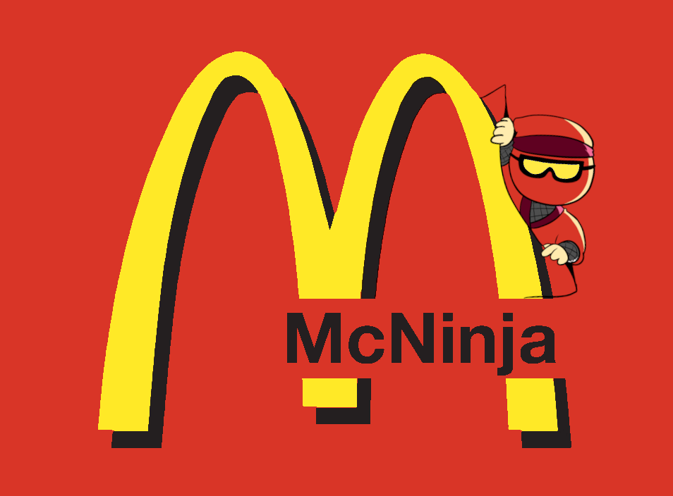

Compiles BinaryNinja's MLIL to LLVM

## Approach
1. Sweep binary for global variables, create them
2. Sweep binary for (used?) external functions, declare those
3. Sweep binary for internal functions, translate them

## FAQ

### Why MLIL instead of HLIL?

HLIL is an attractive source for compiling down to LLVM IR; it has dead stores eliminated, it has control flow constructs recovered, and several other small optimizations.  However, LLVM IR's control flow is extremely simple - it has no `for`, no `while`, only conditional and unconditional branching - which makes MLIL significantly easier to convert.

### How do you pronounce McNinja and where did the name come from

This is a hotly contested issue. We must explore the etymology of the name to find an answer. The "Mc" in McNinja was originally a contraction of the words "Machine Code," and the "ninja" is short for "BinaryNinja."  It is possible that "MC" in that case is pronounced em-see. Alas, even those who understand the origin of the name pronounce it as if it were related to America's favorite fast food joint.
